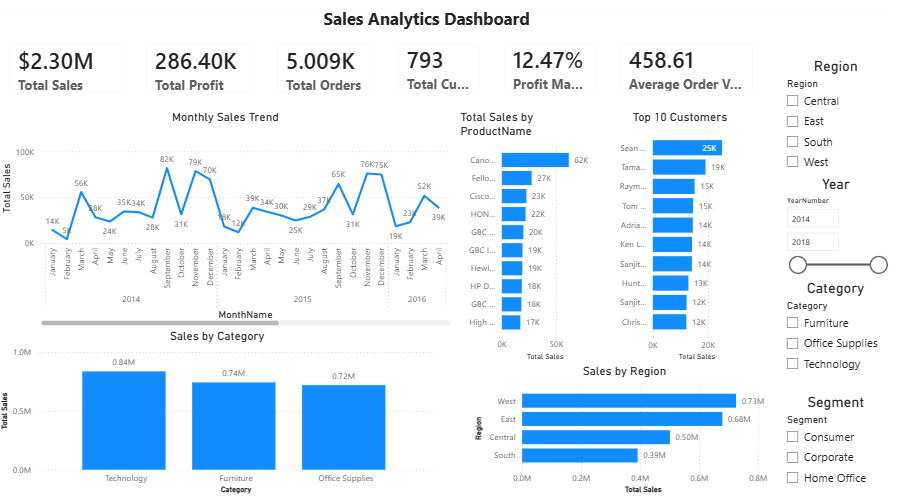
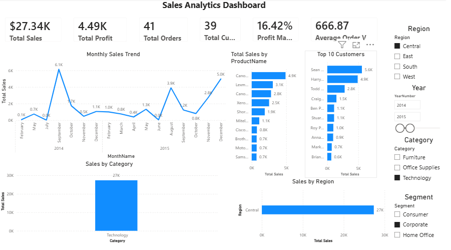

# 📊 Sales Analytics Project


---

# Overview

# Dataset

This project uses the **Superstore Dataset** for educational and portfolio purposes.

**Source:** Kaggle – Superstore Dataset by Vivek Chowdhury  
https://www.kaggle.com/datasets/vivek468/superstore-dataset-final

This project demonstrates a complete end-to-end Sales Analytics solution using Python, SQL Server and Power BI.

The project starts with a raw Excel dataset and follows a complete ETL process to build a SQL Server Data Warehouse based on a Star Schema before creating an interactive Power BI dashboard.

---

# Project Architecture

```
Excel Dataset
      │
      ▼
Python ETL
      │
      ▼
SQL Server Staging
      │
      ▼
SQL Server Data Warehouse
      │
      ▼
Star Schema
      │
      ▼
Power BI Dashboard
```

---

# Technologies

- Python
- Pandas
- NumPy
- SQLAlchemy
- pyodbc
- SQL Server
- Power BI
- Power Query
- DAX

---

# Requirements

- Python 3.12+
- SQL Server
- ODBC Driver 17 for SQL Server
- Power BI Desktop

Install packages

```bash
pip install -r requirements.txt
```

requirements.txt

```text
pandas==3.0.3
numpy==2.5.1
SQLAlchemy==2.0.51
pyodbc==5.3.0
openpyxl==3.1.5
```

---

# Setup

Clone repository

```bash
git clone https://github.com/maximyellowrock/Sales-Analytics-Project.git
```

Create virtual environment

```bash
python -m venv .venv
```

Activate

```bash
.venv\Scripts\activate
```

Install packages

```bash
pip install -r requirements.txt
```

Open

```
etl/load_staging.py
```

Update

```python
SERVER_NAME = r"YOUR_SERVER_NAME"
DATABASE_NAME = "SalesAnalyticsDB"
```

The project uses Windows Authentication.

---

# ETL Pipeline

The ETL pipeline is fully automated using Python.

Execution order

1. data_profiling.py
2. load_staging.py
3. transform.py
4. load_warehouse.py

---

# SQL Scripts

The SQL folder contains scripts for creating the SQL Server database and warehouse tables.

```
sql/
│
├── 01_create_database.sql
├── 02_create_tables.sql
└── 04_kpi_queries.sql
```

---

# Data Warehouse

The warehouse follows a Star Schema design.

### Fact Table

- FactSales

### Dimension Tables

- DimCustomer
- DimProduct
- DimDate
- DimGeography
- DimShipMode

---

# KPI Metrics

- Total Sales
- Total Profit
- Profit Margin %
- Total Orders
- Average Order Value
- Total Customers

---

# Dashboard Features

- Monthly Sales Trend
- Sales by Category
- Sales by Region
- Top 10 Customers
- Top 10 Products
- Interactive Slicers

---

# Dashboard Preview

## Dashboard



## Dashboard With Filters



---

# Folder Structure

```text
Sales-Analytics-Project/
│
├── data/
│   ├── raw/
│   └── processed/
│
├── docs/
│   ├── DataDictionary.md
│   ├── ETLFlow.md
│   └── StarSchema.md
│
├── etl/
│   ├── data_profiling.py
│   ├── load_staging.py
│   ├── transform.py
│   └── load_warehouse.py
│
├── images/
│   ├── dashboard_overview.png
│   └── dashboard_filtered.png
│
├── powerbi/
│   └── SalesAnalytics.pbix
│
├── sql/
│   ├── 01_create_database.sql
│   ├── 02_create_tables.sql
│   └── 04_kpi_queries.sql
│
├── requirements.txt
├── README.md
└── .gitignore
```

---

# Skills Demonstrated

- Python ETL
- Data Cleaning
- Data Validation
- SQL Server
- Data Warehouse
- Star Schema
- Fact & Dimension Modeling
- Power BI
- DAX
- KPI Development
- Dashboard Design

---

# Future Improvements

- Incremental ETL
- Scheduled ETL Pipeline
- dbt Integration
- Azure SQL Database
- CI/CD

---

# Author

**Maxim Fidanov Irinov**

Portfolio project created for Data Analyst / Business Intelligence positions.
